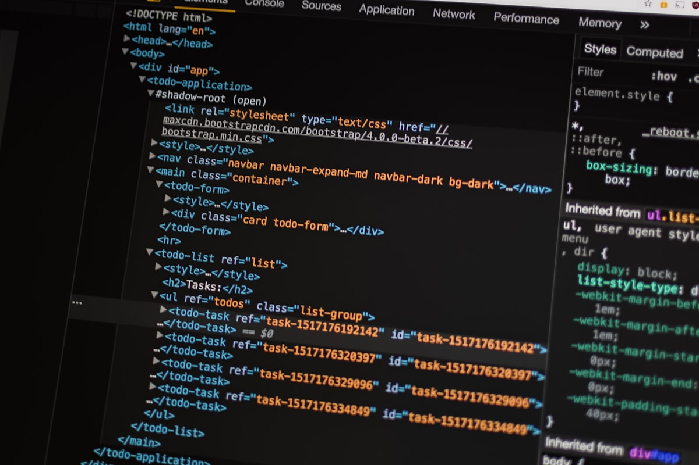

# Jhan Freelance - Portfolio Web

Landing page profesional para la marca personal **Jhan Freelance**, enfocada en desarrollo web, automatización, dashboards, asistentes inteligentes y herramientas internas para negocios, profesionales independientes y sector público.

El proyecto presenta servicios de forma clara y honesta: sin métricas inventadas, sin testimonios ficticios y sin promesas exageradas. La prioridad es mostrar qué se construye, con qué tecnologías y cómo iniciar una conversación directa.

## Vista Previa



## Stack Principal


## Características

- Hero oscuro con fondo visual, navegación superior y CTAs claros.
- Sección "Sobre mí" con enfoque técnico y visual referencial.
- Soluciones: landing pages, SaaS internos, chatbots, automatización, dashboards y plataformas web a medida.
- Stack tecnológico agrupado por lenguajes, frameworks y herramientas.
- Proyectos destacados con imágenes referenciales reales, tecnologías y modal de detalle.
- Sección "Para quién trabajo" con tarjetas diferenciadas por color.
- Proceso de trabajo interactivo paso a paso, con subtareas, progreso y transiciones.
- Formulario de contacto, datos visibles y botón flotante de WhatsApp.
- Diseño responsive con microinteracciones y animaciones suaves al hacer scroll.

## Tecnologías

**Frontend**

- React
- TypeScript
- Vite
- Tailwind CSS
- Motion
- Lucide React

**UI y experiencia**

- Componentes reutilizables
- Secciones alternadas entre fondos oscuros y claros
- Cards con hover, modales y stepper interactivo
- Logos tecnológicos personalizados
- Animaciones discretas en scroll

**Formulario y contacto**

- React Hook Form
- WhatsApp directo con mensaje prellenado
- Enlaces a email, LinkedIn y GitHub

## Estructura Del Proyecto

```txt
/
|-- public/
|   `-- images/                 # Imágenes referenciales usadas en proyectos y secciones
|-- src/
|   |-- app/
|   |   |-- components/          # Secciones y componentes reutilizables
|   |   |   |-- landing/         # Hero principal
|   |   |   |-- ui/              # Componentes base estilo shadcn/ui
|   |   |   |-- About.tsx
|   |   |   |-- Solutions.tsx
|   |   |   |-- Technologies.tsx
|   |   |   |-- Projects.tsx
|   |   |   |-- TargetAudience.tsx
|   |   |   |-- Process.tsx
|   |   |   |-- Contact.tsx
|   |   |   `-- Footer.tsx
|   |   |-- data/
|   |   |   |-- content.ts       # Textos, tecnologías, proyectos y datos de contacto
|   |   |   `-- types.ts
|   |   |-- utils/
|   |   |   `-- whatsapp.ts
|   |   `-- App.tsx
|   |-- assets/
|   |   `-- logo.png
|   |-- styles/
|   |   |-- index.css
|   |   |-- theme.css
|   |   `-- tailwind.css
|   `-- main.tsx
|-- index.html
|-- package.json
|-- tailwind.config.ts
`-- vite.config.ts
```

## Instalación

Requisitos:

- Node.js 18 o superior
- npm

```bash
npm install
```

## Ejecutar En Desarrollo

```bash
npm run dev
```

Luego abre el navegador en:

```txt
http://localhost:5173
```

Si Vite usa otro puerto, revisa la URL que aparece en la terminal.

## Construir Para Producción

```bash
npm run build
```

La versión optimizada se genera en:

```txt
dist/
```

## Personalización Rápida

La mayor parte del contenido editable está en:

```txt
src/app/data/content.ts
```

Desde ahí puedes cambiar:

- Datos de contacto.
- Número de WhatsApp.
- LinkedIn y GitHub.
- Soluciones ofrecidas.
- Tecnologías del stack.
- Proyectos destacados.
- Públicos objetivo.
- Tipos de proyecto del formulario.

## Contacto Configurado

- Email: `jhandev07@gmail.com`
- WhatsApp: `+51 921 561 684`
- LinkedIn: [Jhan Dev](https://www.linkedin.com/in/jhandev07/)
- GitHub: [Angie2-CuentaTrabajo](https://github.com/Angie2-CuentaTrabajo)

## Despliegue Sugerido

Este proyecto puede desplegarse en Vercel, Netlify o cualquier hosting estático.

Para Vercel:

```bash
npm run build
```

Configura:

- Framework preset: `Vite`
- Build command: `npm run build`
- Output directory: `dist`

## Estado

Proyecto en desarrollo visual, preparado para seguir ajustando contenido personal, proyectos reales y capturas finales.
